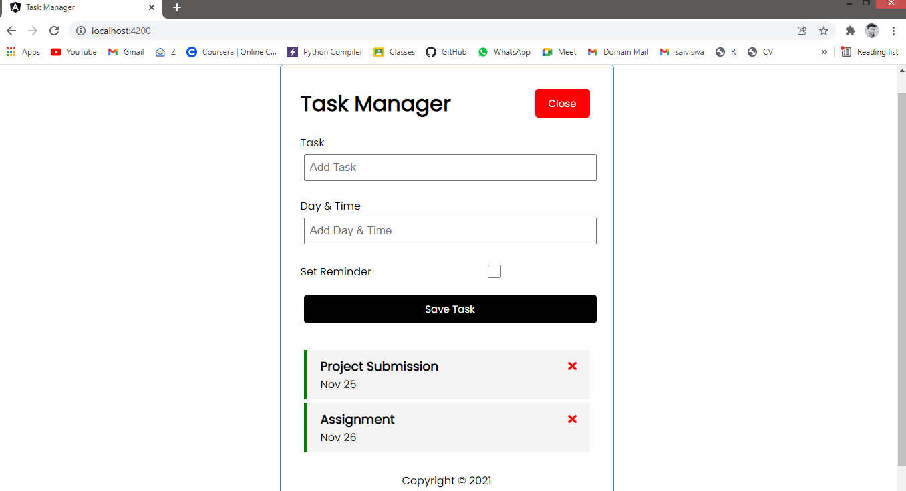

# TaskManager


## Usage

### Install dependencies

```
npm install
```

### Run Angular server (http://localhost:4200)

```
ng serve
```

### Run the JSON server (http://localhost:5000)

```
npm run server
```

### To build for production

```
ng build
```
